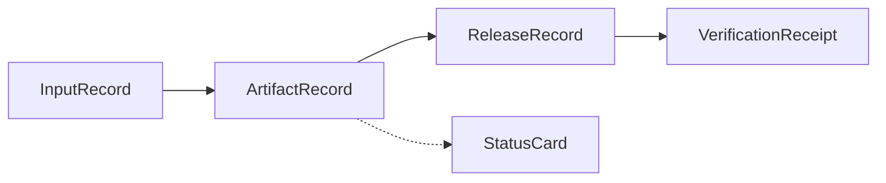

Five public record families appear across these docs. They are hand-curated for interoperability, not generated from backend schemas, and no page here publishes a raw table or internal event payload.

## Families

| Record | Purpose | Contract page |
| --- | --- | --- |
| `InputRecord` | Describes submitted material and mapping context. | [Input records](/records/input-record) |
| `ArtifactRecord` | Describes produced work and its review and release status. | [Artifact records](/records/artifact-record) |
| `ReleaseRecord` | Describes what was authorized and made available. | [Release records](/records/release-record) |
| `VerificationReceipt` | Describes what can be inspected about a released record. | [Verification receipts](/records/verification-receipt) |
| `StatusCard` | Summarizes lifecycle state, owner, blockers, and next action. | [Status card](/records/status-card) |

## Schema posture

The public schema stays stable so partners can map against it. The implementation underneath is free to change. Field names describe state, shape, and authority; fields that would carry reviewer reasoning, scoring, or gate output are excluded at design time, per the [Disclosure boundary](/start/disclosure-boundary).

## Not included

<Note>
These docs do not publish raw tables, internal event payloads, prompt inputs, scoring outputs, procedure programs, or review rationale.
</Note>
