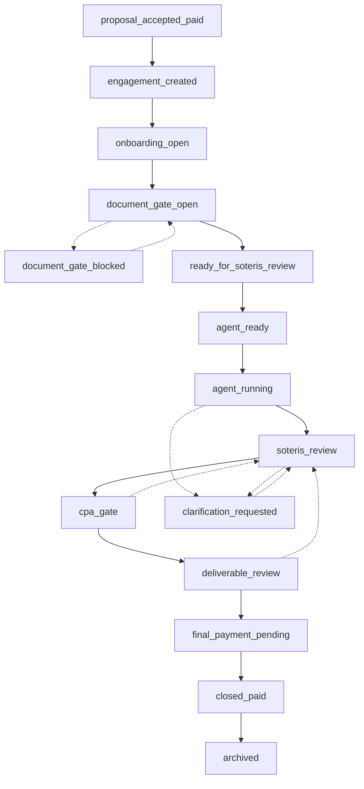

The lifecycle is the shared operational language of an engagement. It gives every actor, human, partner, and agent, one answer to the question "where is this, and what can happen next."

An engagement moves through phases, from an accepted and paid proposal, through onboarding and input collection, into preparation and review, to release and final settlement, and finally to archive. Each phase is a state, not a folder. State says what is true now and which transition is allowed next.

## Phases at a glance

1. **Engaged.** The proposal is accepted and paid, and an engagement exists.
2. **Onboarding.** Controlled inputs are collected and the input gate opens or blocks.
3. **Preparation.** The engagement is queued for and moves through automated preparation and any clarification.
4. **Review.** Soteris review and the review gate govern professional approval.
5. **Deliverable.** The deliverable is reviewed and released, and final settlement is pending.
6. **Closed.** The engagement is settled and archived.

This page is deliberately high level. The exact set of state names an integration should rely on is the partner-safe vocabulary in [Public states](/state-machine/public-states), and the canonical list is in the [Lifecycle enum](/reference/lifecycle-enum).

## State diagram

Solid edges are the forward path. Dashed edges are exception paths: loop-backs, blocks, and clarifications. Each dashed edge is specified, with its live vs contract-preview status, in [Exception paths](/state-machine/exception-paths).

The diagram shows direction, not criteria. Whether any edge is taken is governed by internal evaluation that stays private.

## What the lifecycle does not expose

<Info>
  The lifecycle tells you the state and the allowed direction of travel. It does not expose the internal criteria that admit or block a transition. A review gate, for example, is visible as a state, never as the rule it applies. For that boundary, see [State transitions](/state-machine/state-transitions) and the [Disclosure boundary](/start/disclosure-boundary).
</Info>
