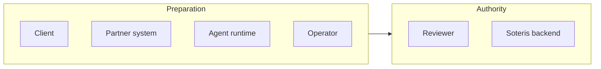

Every state and transition is scoped to actors. An actor is anyone or anything that can touch an engagement: the client, the partner system, the agent runtime, the operator, the reviewer, and the Soteris backend. The boundaries exist to keep preparation separate from authority.

## Actors

| Actor | Can prepare, read, or request | Cannot do |
| --- | --- | --- |
| Client | Submit inputs, read own engagement status, respond to clarifications | Change lifecycle state or authorize release |
| Partner system | Read agreed state and record shapes, submit mapped inputs | Approve, review, or release |
| Agent runtime | Read permitted context, prepare drafts and findings, request clarification | Conclude, approve, or release |
| Operator | Coordinate workflow, move an engagement through operational steps | Provide professional approval |
| Reviewer | Exercise review authority, approve, authorize release | Delegate professional judgment to an agent |
| Soteris backend | Validate transitions, record events, store references | Substitute for reviewer judgment |

## Division of ownership

Preparation and authority are different roles by design. Agents and operators move work forward. Only the reviewer holds professional approval, and only the backend commits state. This is how automated preparation advances the work without becoming the authority of record.

For a partner system, the practical consequence: nothing your side submits, and nothing an agent prepares, changes official state by itself. State changes when the actor with authority for that transition commits it, per [State transitions](/workflow/state-transitions). The same split governs release, in [Release conditions](/workflow/release-conditions).
