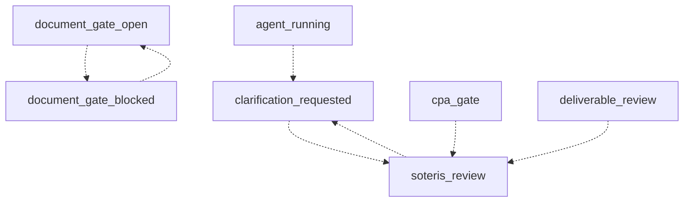

A real engagement can be blocked, sent back, interrupted, or stopped. This page names those paths so a partner system can model them as states, without encoding the criteria that trigger them.

State meanings are defined in [Public states](/workflow/public-states); the forward path they branch from is in [Lifecycle overview](/workflow/lifecycle-overview).

Every row carries a status:

- **Live.** The path is a code-backed part of the current system.
- **Contract preview.** The state names are part of the published contract vocabulary, but the transition is not yet wired as a live path. Model it; do not depend on observing it yet.
- **Live as an outcome record.** The value is code-backed, recorded as an outcome record adjacent to the lifecycle rather than as a lifecycle state.

## Loop-backs

A loop-back returns an engagement to an earlier point without ending it. It is the normal exception case, not a failure.

| From | To | Trigger | Authority | Status |
| --- | --- | --- | --- | --- |
| `document_gate_open` | `document_gate_blocked` | Inputs evaluated as insufficient | Soteris backend | `Contract preview` |
| `document_gate_blocked` | `document_gate_open` | Additional inputs requested and received | Client / partner input | `Contract preview` |
| `agent_running` | `clarification_requested` | Clarification needed to continue | Agent runtime / operator | `Contract preview` |
| `clarification_requested` | `soteris_review` | Clarification resolved | Soteris backend | `Contract preview` |
| `soteris_review` | `clarification_requested` | Follow-up needed from client or partner | Reviewer | `Contract preview` |
| `cpa_gate` | `soteris_review` | Rework requested | Reviewer | `Contract preview` |
| `deliverable_review` | `soteris_review` | Revision requested | Reviewer | `Contract preview` |

## Review gate outcomes

The review gate concludes in one of a small set of outcomes. The gate stays opaque: the outcome is visible, the evaluation is not.

| Outcome | Meaning | Status |
| --- | --- | --- |
| `approved` | The engagement proceeds to deliverable review. | `Live` |
| `rejected` | The gate did not approve. The engagement does not proceed on this path. | `Live as an outcome record` |
| `waived` | The gate was waived by review authority. | `Live as an outcome record` |
| `rework` | The engagement returns to Soteris review. | `Contract preview` |

`rejected` and `waived` are recorded as gate outcome records adjacent to the lifecycle. They are not lifecycle states, and the lifecycle state remains opaque while they are being decided.

## Stopped before the engagement exists

A proposal can end without ever becoming an engagement. These outcomes occur before `proposal_accepted_paid`, so no engagement record is created.

| Phase | Possible outcomes | Status |
| --- | --- | --- |
| Proposal | `declined`, `expired`, `paused` | `Contract preview` |
| Signature | `declined`, `expired`, `voided` | `Contract preview` |
| Initial payment | `failed`, `refunded`, `voided` | `Contract preview` |

## Interrupted preparation

An automated preparation run can end without producing artifacts: `failed`, `paused`, or `cancelled`. These are runtime statuses, not lifecycle transitions. The engagement stays in its current lifecycle state, and preparation can be re-run under the same authority rules.

## Termination and withdrawal

<Warning>
There is no `terminated` or `withdrawn` lifecycle state today. Do not model mid-engagement termination as a state you can observe. If an engagement stops, it stops through one of the outcomes above or by remaining in a non-terminal state. A formal termination path is a roadmap item. When it ships, it will be added to the [Lifecycle enum](/reference/lifecycle-enum) first.
</Warning>

## Terminal states

`archived` is the only terminal lifecycle state. The outcome statuses that stop progress without a lifecycle transition are `declined`, `expired`, `voided`, `refunded`, `failed`, and `cancelled`. The complete outcome-status vocabulary is the outcome table in the [Lifecycle enum](/reference/lifecycle-enum).

## Boundary

<Note>
This page names states, directions, triggers, and authorities. It does not describe the criteria that decide any of them: what makes inputs insufficient, what a gate evaluates, or when review authority requests rework. See the [Disclosure boundary](/start/disclosure-boundary).
</Note>
