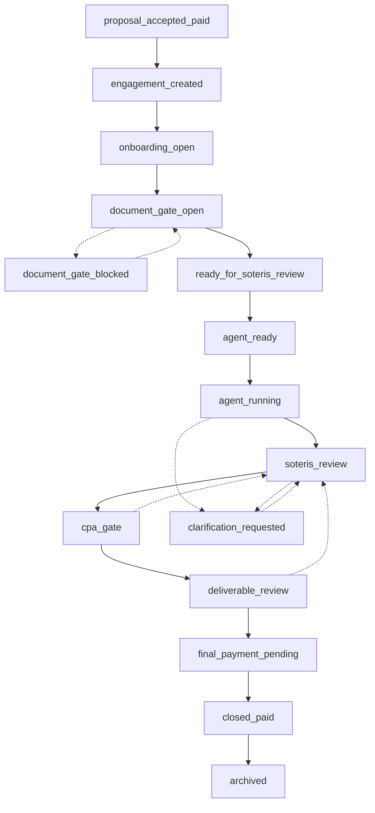

Every engagement is in exactly one lifecycle state. State is the shared operational language: it gives the client, the partner system, the agent, and Soteris one answer to "where is this, and what can happen next."

An engagement begins when a proposal is accepted and paid. It moves through onboarding and input collection, into automated preparation and professional review, then to release and final settlement, and ends at archive. Each step is a state with controlled transitions, not a folder or a status label someone edits.

## The state machine

Solid edges are the forward path. Dashed edges are exception paths: blocks, loop-backs, and clarifications. Every dashed edge is specified, with a live or contract-preview status, in [Exception paths](/workflow/exception-paths).

The diagram shows direction, not criteria. Whether an edge is taken is decided by internal evaluation that stays private.

## Phases

1. **Engaged.** The proposal is accepted and paid. An engagement record exists.
2. **Onboarding.** Controlled inputs are collected. The input gate opens or blocks.
3. **Preparation.** Automated preparation runs, with clarification loops where needed.
4. **Review.** Soteris review and the review gate govern professional approval.
5. **Deliverable.** The deliverable is reviewed, released, and final settlement is pending.
6. **Closed.** The engagement is settled and archived.

## Where the detail lives

This page is the map. The state names an integration should rely on are in [Public states](/workflow/public-states), the forward transitions in [State transitions](/workflow/state-transitions), the exception vocabulary in [Exception paths](/workflow/exception-paths), and the canonical list in the [Lifecycle enum](/reference/lifecycle-enum).

The lifecycle tells you the state and the allowed direction of travel. It does not expose the criteria that admit or block any transition. A review gate is visible as a state, never as the rule it applies.
